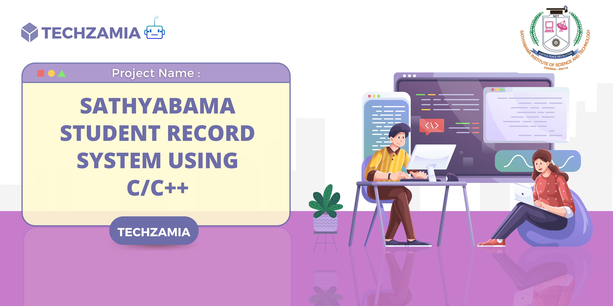

<h3 align=center><b> ✨ Sathyabama Student Record System using c/c++ ✨</b></h3>

---

---

<h1 align="center">Hi </h1>

#  I have made my project on Sathyabama Student Record System using c/c++ for the Round 3 of Techzamia.

:arrow_forward: In this Sathyabama Student Record System using c/c++ project, we can do basic Student Record tasks like :
- adding the student info
- view the added student
- search the students
- update login password

:round_pushpin: I have included login screen in Sathyabama Student Record System, So that only Sathyabama Staffs will be able to login to this application in order to   protect the data.

:zap: In this project i have used some of following C/C++ concepts and I have compiled my project with GCC compiler :

&emsp;:one: fopen  
&emsp;:two: fread  
&emsp;:three: fwrite 
&emsp;:four: functions 
&emsp;:five: loops 
&emsp;:six:struct datatype 
&emsp;:seven:if else 

- This project is a Command line utility or console application whic usese C programming language.
